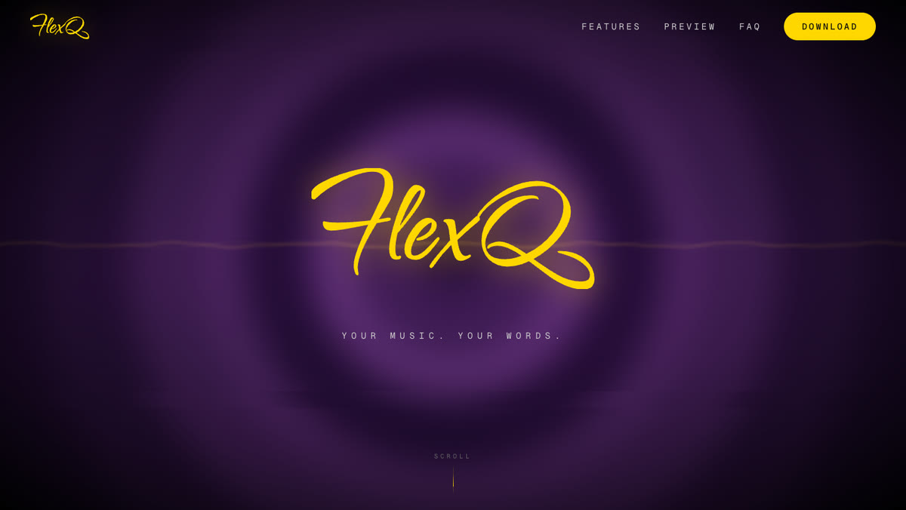
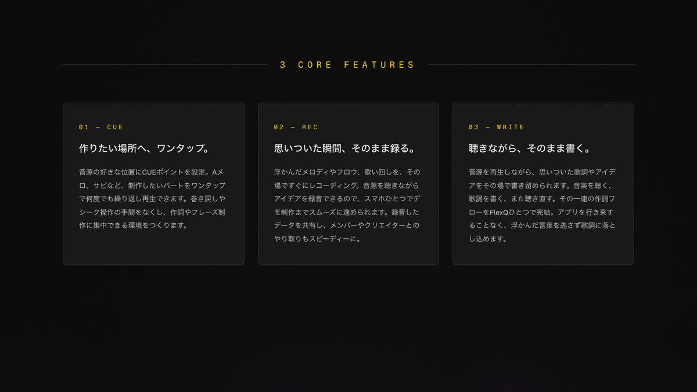
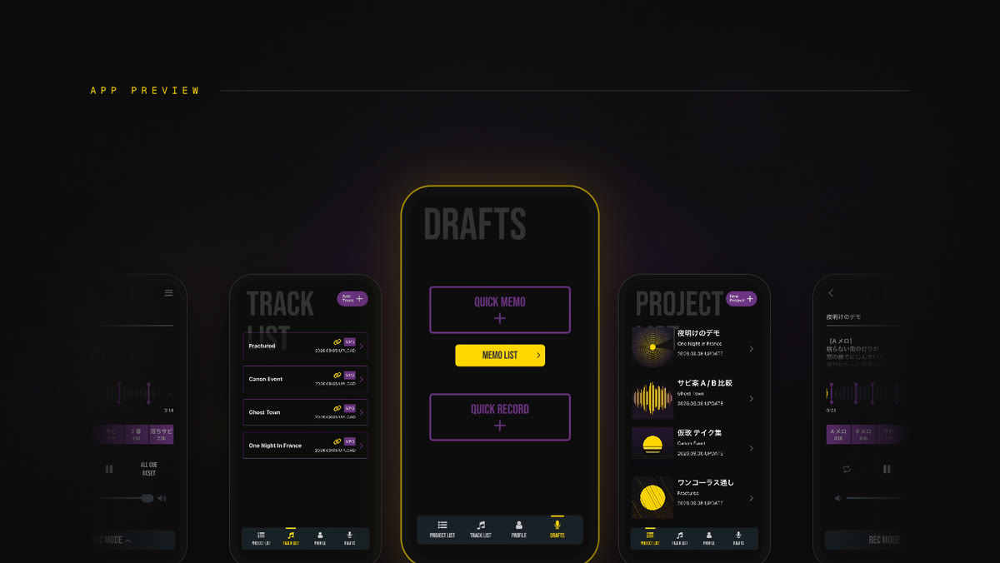
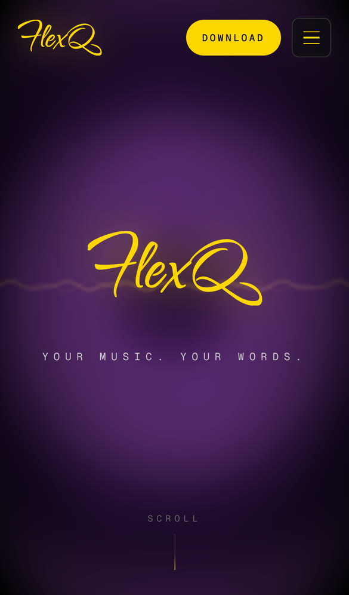
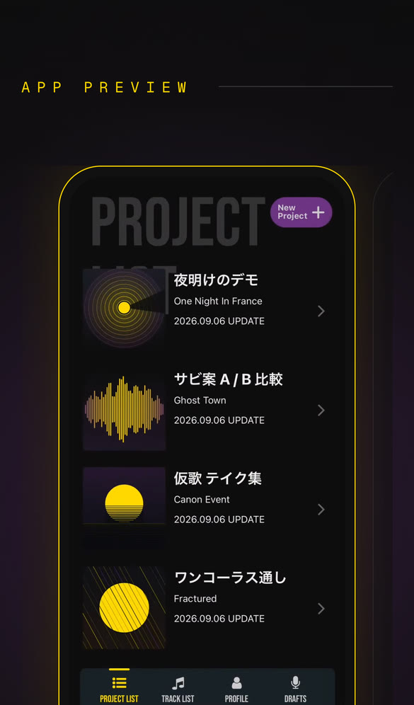
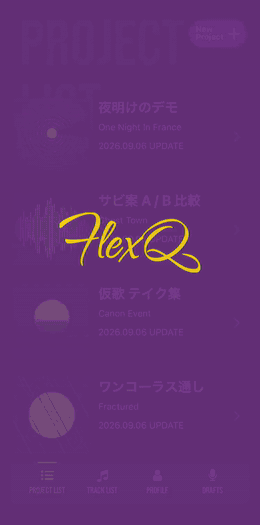
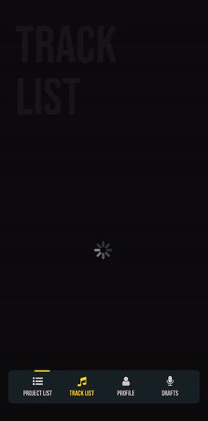

<div align="center">
  
  <p><strong>YOUR MUSIC. YOUR WORDS.</strong></p>
  <p>WRITE / RECORD / PLAY — 一瞬で名曲を生み出すために</p>
  <p>
    <a href="https://flexqstudio.com/">公式サイト</a> ·
    <a href="#サイト概要">サイト概要</a> ·
    <a href="#サイトの画面">サイトの画面</a> ·
    <a href="#掲載コンテンツ">掲載コンテンツ</a> ·
    <a href="#技術スタック">技術スタック</a> ·
    <a href="#ローカル開発">ローカル開発</a> ·
    <a href="#テスト">テスト</a> ·
    <a href="#ブランチ運用とデプロイ">デプロイ</a>
  </p>
</div>

---

## サイト概要

音楽制作サポートアプリ **FlexQ** のプロモーションサイト（[flexqstudio.com](https://flexqstudio.com/)）のフロントエンドです。Next.js（App Router）で構築し、Vercel から配信しています。

アプリ本体は [flexq-mobile](https://github.com/yoshiydp/flexq-mobile)（React Native / Expo）で開発しています。

> **現在の公開状況**
>
> - **サイトは独自ドメインで配信中**ですが、アプリのストア公開前のため**検索エンジンには露出させていません**（全ページ `noindex`・`robots.txt` は全拒否）。アプリの一般公開は 2026 年内を予定しています
> - **ストアバッジのリンク先は未設定**です。設定するまではページ内のダウンロード CTA へのアンカーになります
> - **CMS（Strapi）は休止中**で、本番は `src/content/fallbacks.ts` の文言による静的 LP として動いています。News / Learn セクションと記事ページへの導線は自動的に非表示になります（[コンテンツ管理](#コンテンツ管理)を参照）
>
> 公開時に必要な作業は[一般公開時にやること](#一般公開時にやること)にまとめています。

---

## サイトの画面

| HERO | 3 CORE FEATURES | APP PREVIEW |
| :---: | :---: | :---: |
|  |  |  |
| WebGL のキービジュアル（GLSL シェーダー） | CUE / REC / WRITE の 3 枚のカード | アプリの画面収録が流れる自動カルーセル |

| HERO（SP） | APP PREVIEW（SP） |
| :---: | :---: |
|  |  |
| ハンバーガーメニュー + DOWNLOAD ボタン | 手動スワイプのカルーセル（中央の 1 台にゴールド枠） |

> 本番（`https://flexqstudio.com/`）を PC 1440x810 / iPhone 14 のビューポートで撮影したものです（2026-10-01 時点）。

---

## 掲載コンテンツ

トップページは上から順に次のセクションで構成されています。文言はすべて `src/content/fallbacks.ts` で管理しています。

| セクション | アンカー | 内容 |
| --- | --- | --- |
| Hero | `#hero` | ロゴとタグライン「YOUR MUSIC. YOUR WORDS.」。背景は WebGL のキービジュアル |
| Statement | `#statement` | コンセプト文（WRITE / RECORD / PLAY — 一瞬で名曲を生み出すために） |
| 3 CORE FEATURES | `#features` | CUE / REC / WRITE の紹介 |
| APP PREVIEW | `#preview` | アプリの画面収録 4 本のカルーセル |
| NEWS | `#news` | お知らせの新着（CMS にデータがあるときだけ表示） |
| LEARN & READ | `#learn` | チュートリアルとコラムの新着（同上） |
| FAQ | `#faq` | よくある質問 7 件（開閉式） |
| Download CTA | `#download` | 「さあ、次の一節を。」+ App Store / Google Play のバッジ |

### コンセプト

**FlexQ** は、シンガー・ラッパー・クリエイターのための音楽制作サポートアプリです。

音源の好きな位置から何度でもすぐに再生できる「CUE 機能」で、作詞・歌詞制作をよりスムーズに。さらに「REC 機能」を使えば、思いついたフレーズや歌声をその場ですぐに録音し、簡単に共有できます。聴く、書く、録る、共有する。FlexQ が、あなたの音楽制作をもっと自由に、もっとスピーディーにします。

### 3 CORE FEATURES

| | 見出し | 説明 |
| --- | --- | --- |
| **01 — CUE** | **作りたい場所へ、ワンタップ。** | 音源の好きな位置に CUE ポイントを設定。A メロ、サビなど、制作したいパートをワンタップで何度でも繰り返し再生できます。巻き戻しやシーク操作の手間をなくし、作詞やフレーズ制作に集中できる環境をつくります。 |
| **02 — REC** | **思いついた瞬間、そのまま録る。** | 浮かんだメロディやフロウ、歌い回しを、その場ですぐにレコーディング。音源を聴きながらアイデアを録音できるので、スマホひとつでデモ制作までスムーズに進められます。録音したデータを共有し、メンバーやクリエイターとのやり取りもスピーディーに。 |
| **03 — WRITE** | **聴きながら、そのまま書く。** | 音源を再生しながら、思いついた歌詞やアイデアをその場で書き留められます。音楽を聴く、歌詞を書く、また聴き直す。その一連の作詞フローを FlexQ ひとつで完結。アプリを行き来することなく、浮かんだ言葉を逃さず歌詞に落とし込めます。 |

### APP PREVIEW

| PROJECT LIST | PROJECT EDITOR | TRACK LIST | QUICK RECORD |
| :---: | :---: | :---: | :---: |
|  |  |  |  |
| 作詞プロジェクトの一覧 | CUE ポイントを置いて、聴きながら書く | 取り込んだ音源の管理・再生 | DRAFTS タブからその場で録音 |

サイトに埋め込んでいる画面収録（`public/preview/`）を GIF にしたものです。素材の仕様と差し替え方は [APP PREVIEW の素材](#app-preview-の素材)を参照してください。

### FAQ

| 質問 | 回答 |
| --- | --- |
| FlexQ の利用は無料ですか？ | 全機能を無料でご利用いただけます。 |
| 対応している OS を教えてください。 | iPhone と Android の両方に対応しています。App Store / Google Play からダウンロードできます。 |
| アカウント登録は必要ですか？ | はい、必要です。受信可能なメールアドレスとパスワードでご登録いただけます。Google アカウントでの登録にも対応しています。 |
| 手持ちの音源ファイルを取り込めますか？ | はい。端末内の音源ファイルをプロジェクトに取り込み、再生しながらリリックを執筆できます。 |
| オフラインでも使えますか？ | リリックの執筆・録音メモ・音源の再生は、オフラインでもご利用いただけます。 |
| 書いたリリックを書き出せますか？ | テキストとして書き出し、他のアプリへ共有できます。録音メモは音声ファイルとして書き出せます。 |
| 不具合や要望はどこに連絡すればよいですか？ | アプリ内のフィードバックからお送りください。いただいた内容は今後のアップデートに反映していきます。 |

---

## 技術スタック

| 項目 | バージョン / 内容 |
| --- | --- |
| フレームワーク | Next.js 16.2.9（App Router・ISR） |
| React | 19.2.4 |
| 言語 | TypeScript 5 |
| スタイリング | Tailwind CSS v4 |
| UI コンポーネント | shadcn/ui（style: `base-nova`）/ @base-ui/react / lucide-react |
| WebGL キービジュアル | three 0.185 + @react-three/fiber 9 RC（GLSL カスタムシェーダー） |
| 慣性スクロール | Lenis |
| CMS / API | Strapi v5（[lyrics-web-strapi](https://github.com/yoshiydp/lyrics-web-strapi)）※ 現在は休止中 |
| ホスティング | Vercel（プロジェクト `flexq-web`） |
| Node.js | 22（`.nvmrc`） |
| パッケージマネージャー | Yarn 1.22（Classic） |

### 開発ツール

| ツール | 用途 |
| --- | --- |
| Jest 30 + Testing Library | ユニットテスト・コンポーネントテスト |
| Playwright | E2E テスト（desktop / mobile の 2 プロジェクト） |
| ESLint（eslint-config-next） | 静的解析 |
| Codex CLI | コミット前のコードレビュー（`/codex-review`） |

### 関連リポジトリ

| リポジトリ | 役割 |
| --- | --- |
| `flexq-web-frontend`（本リポジトリ） | プロモーションサイトのフロントエンド（Next.js） |
| [`lyrics-web-strapi`](https://github.com/yoshiydp/lyrics-web-strapi) | Headless CMS（Strapi v5）。記事とトップページの文言を供給する |
| [`flexq-mobile`](https://github.com/yoshiydp/flexq-mobile) | アプリ本体（React Native / Expo） |

> 本リポジトリは `lyrics-web-frontend` から改名しています（旧 URL は GitHub がリダイレクトします）。`package.json` の `name` と CMS のリポジトリ名には旧名称が残っています。

---

## ページ構成

| パス | ファイル | 説明 |
| --- | --- | --- |
| `/` | `src/app/page.tsx` | トップページ（Hero 〜 Download CTA） |
| `/news` | `src/app/news/page.tsx` | お知らせ一覧 |
| `/news/[slug]` | `src/app/news/[slug]/page.tsx` | お知らせ詳細 |
| `/tutorials` | `src/app/tutorials/page.tsx` | チュートリアル一覧（難易度バッジ付き・連載順） |
| `/tutorials/[slug]` | `src/app/tutorials/[slug]/page.tsx` | チュートリアル詳細 |
| `/columns` | `src/app/columns/page.tsx` | コラム一覧 |
| `/columns/[slug]` | `src/app/columns/[slug]/page.tsx` | コラム詳細 |
| `/privacy-policy` | `src/app/privacy-policy/page.tsx` | プライバシーポリシー |
| `/terms` | `src/app/terms/page.tsx` | 利用規約 |
| `/robots.txt` | `src/app/robots.ts` | 公開前は `Disallow: /` |
| `/sitemap.xml` | `src/app/sitemap.ts` | 公開前は空の `<urlset>` |

- 記事ページ（news / tutorials / columns）は CMS が供給します。CMS 休止中は一覧が空状態になり、トップページからの導線も出ません
- プライバシーポリシーと利用規約はフッターからリンクしています（Google OAuth 同意画面のブランディング設定が参照する公開 URL でもあります）
- サイト内のパスは `src/lib/routes.ts`、ナビゲーションのリンクは `src/components/layout/navLinks.ts` で一元管理しています

---

## ディレクトリ構成

```
.
├── src/
│   ├── app/                    # App Router のルート（上の「ページ構成」）
│   │   ├── layout.tsx           # ルートレイアウト（フォント・metadata・慣性スクロール）
│   │   ├── template.tsx         # ページ遷移のフェード
│   │   ├── loading.tsx          # 読み込み中の波形ローダー
│   │   └── globals.css          # Tailwind・カラー変数・リビールのアニメーション
│   ├── components/
│   │   ├── canvas/              # WebGL キービジュアル（react-three-fiber + GLSL）
│   │   ├── layout/              # ヘッダー・フッター・SP メニュー・慣性スクロール・ページ遷移
│   │   ├── sections/            # トップページの各セクション
│   │   ├── seo/                 # 構造化データ（JSON-LD）
│   │   └── ui/                  # 記事カード・ストアバッジ・リビールなどの部品
│   ├── content/
│   │   └── fallbacks.ts         # トップページの文言（CMS 休止中はここが正）
│   ├── lib/
│   │   ├── site.ts              # サイト URL・説明文・問い合わせ先・index 可否
│   │   ├── routes.ts            # サイト内パス
│   │   ├── strapi.ts            # Strapi の fetch ラッパー
│   │   ├── content.ts           # コンテンツ解決層（CMS の値とフォールバックのマージ）
│   │   └── metadata.ts          # サブページ共通の metadata
│   └── types/
├── public/
│   ├── preview/                 # APP PREVIEW の画面収録（mp4 / webm / ポスター）
│   ├── badges/                  # App Store / Google Play の公式バッジ
│   ├── bg-*.png                 # 各セクションの背景
│   └── og.png                   # OG 画像（1200x630）
├── e2e/                         # Playwright のフロー
├── docs/
│   ├── custom-domain-and-release.md   # 独自ドメイン構成と公開までの手順
│   └── readme/                  # この README で使う画像
└── CLAUDE.md                    # 実装上の注意点（スクロール演出・SEO・WebGL など）
```

---

## ローカル開発

### 前提条件

- Node.js 22（`nvm use` で `.nvmrc` のバージョンに切り替わります）
- Yarn 1.22（Classic）
- **Strapi は起動していなくても動きます。** CMS に繋がらない場合、トップページはフォールバック文言で描画され、記事一覧は空状態になります。記事ページまで確認したいときだけ [lyrics-web-strapi](https://github.com/yoshiydp/lyrics-web-strapi) を `http://localhost:1337` で起動してください

### セットアップ

```bash
git clone git@github.com:yoshiydp/flexq-web-frontend.git
cd flexq-web-frontend

yarn install --ignore-engines
cp .env.local.example .env.local
yarn dev
```

`http://localhost:3000` で開きます。

> `--ignore-engines` は、Node.js 22 で一部の依存（eslint-visitor-keys）の `engines` 制約に掛かるのを避けるために付けています。

### 環境変数

| 変数名 | 既定値 | 説明 |
| --- | --- | --- |
| `NEXT_PUBLIC_STRAPI_URL` | `http://localhost:1337` | Strapi の URL。繋がらない場合はフォールバック文言で描画する |
| `STRAPI_API_TOKEN` | （未設定） | Strapi の API トークン（任意）。設定すると `Authorization` ヘッダーに付けて取得する。本番で CMS を接続する場合は設定する |
| `NEXT_PUBLIC_SITE_URL` | `https://flexqstudio.com` | canonical / OG / 構造化データの基準 URL。Vercel の Production にのみ設定している |

`.env.local` は gitignore 済みです。Vercel が自動で設定する `VERCEL_ENV` は、検索エンジンへの露出判定（`src/lib/site.ts`）に使っています。

### コマンド

```bash
yarn dev          # 開発サーバー（http://localhost:3000）
yarn build        # 本番ビルド
yarn start        # 本番起動（ビルド済みの場合）
yarn lint         # ESLint

yarn test         # Jest（ウォッチモード）
yarn test:ci      # Jest（カバレッジ付き）
yarn e2e          # Playwright（事前に yarn build が必要）
yarn e2e:ui       # Playwright の UI モード
```

---

## コンテンツ管理

### CMS 休止中の運用（現在）

Strapi Cloud が有料のため、本番への CMS 接続は見送っています（2026-08-15 決定）。

- 本番はフォールバック文言（`src/content/fallbacks.ts`）による**静的 LP** として公開しています
- **文言を直すときは `src/content/fallbacks.ts` を編集してリリースします**
- NEWS / LEARN & READ のセクションは、記事が 1 件もないときセクションごと非表示になり、ヘッダー・フッターのナビからも該当リンクが外れます
- CMS 連携の実装（記事ページ・top-page の single type・データ層）はコードとして残してあります。ローカルで Strapi を起動すれば全機能を確認できます

CMS を復活させる手順は `CLAUDE.md` の「CMS 休止中の運用」を参照してください。

### データ取得

Strapi の REST API を `fetch` + `revalidate`（ISR・60 秒）で取得します。取得は `src/lib/strapi.ts`、Strapi のレスポンスから画面用の型への変換とフォールバックのマージは `src/lib/content.ts` に集約しています。取得に失敗してもビルドやレンダリングは落ちません。

```
# トップページ（single type）
GET /api/top-page?populate[features]=*&populate[screens][populate]=screenshot&populate[faqs]=*&populate[cta]=*

# お知らせ（一覧 / スラッグ指定）
GET /api/news-articles?populate=*&sort=publishedAt:desc
GET /api/news-articles?filters[slug][$eq]={slug}&populate=*

# チュートリアル（連載順）
GET /api/tutorials?populate=*&sort=order:asc

# コラム
GET /api/columns?populate=*&sort=publishedAt:desc
```

> パスは各 content type の `pluralName` に基づきます。お知らせは `/api/news-articles` です（`/api/news` ではありません）。

### APP PREVIEW の素材

APP PREVIEW の画面収録は CMS ではなくリポジトリ（`public/preview/`）で管理しています。1 画面につき次の 3 ファイルを置きます。

| ファイル | 仕様 |
| --- | --- |
| `<name>.mp4` | H.264 / 750x1630 / 30fps / 音声なし |
| `<name>.webm` | VP9 / 750x1630 / 30fps / 音声なし |
| `<name>-poster.jpg` | 750x1630 の静止画（動画の読み込み前に表示） |

現在の 4 本（`project-list` / `project-editor` / `track-list` / `quick-record`）は iOS シミュレーター（iPhone 17 Pro・論理解像度 402x874）で収録し、750x1630 に縮小したものです。上端 62pt（時計・Dynamic Island・通信 / バッテリー表示）は動画から切り落とさず、表示側（`src/components/sections/AppPreview.tsx`）が枠の比率を 402x812 にして隠しています。収録端末を変える場合は同ファイルの `SCREEN_ASPECT` / `SCREEN_RATIO` を合わせて直してください。

差し替えるときの手順の例です。

```bash
# 1. シミュレーターの画面を収録（Ctrl+C で停止）
xcrun simctl io booted recordVideo --codec=h264 raw.mov

# 2. 上の仕様に合わせて書き出す
ffmpeg -i raw.mov -an -vf "scale=750:1630,fps=30" -c:v libx264 -pix_fmt yuv420p -crf 28 -movflags +faststart public/preview/<name>.mp4
ffmpeg -i raw.mov -an -vf "scale=750:1630,fps=30" -c:v libvpx-vp9 -b:v 0 -crf 36 public/preview/<name>.webm
ffmpeg -i public/preview/<name>.mp4 -frames:v 1 -q:v 3 public/preview/<name>-poster.jpg

# 3. 画面を追加・削除した場合は src/content/fallbacks.ts の screens を更新する
```

この README の GIF は、ステータスバー（上端 62pt = 116px）を切り落として生成しています。素材を差し替えたら作り直してください（`project-list` はサイズを抑えるため `fps=8` にしています）。

```bash
ffmpeg -i public/preview/<name>.mp4 \
  -vf "crop=750:1514:0:116,fps=10,scale=260:-1:flags=lanczos,split[s0][s1];[s0]palettegen=max_colors=128[p];[s1][p]paletteuse=dither=bayer:bayer_scale=5" \
  -loop 0 docs/readme/<name>.gif
```

---

## テスト

### ユニットテスト（Jest + Testing Library）

```bash
yarn test                                        # ウォッチモード
yarn test:ci                                     # カバレッジ付き
yarn test src/components/ui/StoreLinks.test.tsx  # 単一ファイル
```

- テストはソースファイルと同じ場所に置きます（`Component.tsx` の隣に `Component.test.tsx`）
- データ層（`src/lib/content.ts`）は `global.fetch` をモックしてテストします（実際の Strapi には接続しません）
- `src/components/canvas/`（WebGL）は jsdom でテストできないためカバレッジ対象外です

### E2E テスト（Playwright）

```bash
npx playwright install chromium   # 初回のみ
yarn build                        # webServer が yarn start --port 3200 を自動起動する
yarn e2e                          # desktop / mobile（iPhone 14 ビューポート）の両方で実行
npx playwright test e2e/top-page.spec.ts   # 単一フロー
```

| フロー | 検証内容 |
| --- | --- |
| `e2e/top-page.spec.ts` | ヒーロー・主要セクションの描画、FAQ の開閉、ストアバッジ、アンカー遷移 |
| `e2e/mobile-menu.spec.ts` | SP メニューの開閉とメニュー内のストアバッジ |
| `e2e/articles.spec.ts` | 記事一覧 → 詳細の遷移、存在しない記事の 404 |
| `e2e/features-linebreak.spec.ts` | 3 CORE FEATURES の見出しの改行位置（PC / TB / SP） |

- Strapi は起動していなくても通ります（CMS に依存するアサーションは、データあり / 空状態のどちらでも成立するように書いています）
- 起動済みのサーバーを使う場合は `PLAYWRIGHT_BASE_URL=http://localhost:3000 yarn e2e`
- `yarn e2e:record` は、幅を変えながら見出しの改行を録画して `test-results/video/` に mov を書き出します（要 ffmpeg）

---

## ブランチ運用とデプロイ

Vercel の GitHub 連携で、ブランチへの push をトリガーに自動デプロイされます。

```
feature/* ──PR──▶ develop ──直接マージ──▶ staging ──PR──▶ master ──▶ 本番（flexqstudio.com）
```

| ブランチ | 役割 | デプロイ先 |
| --- | --- | --- |
| `feature/*` | 作業ブランチ。`develop` へ PR | Preview（ブランチごとに URL が発行される） |
| `develop` | 開発のベースブランチ（GitHub のデフォルトブランチ） | — |
| `staging` | 公開前の表示確認用。`develop` を直接マージする | Preview: `https://flexq-web-git-staging-flexq-web.vercel.app` |
| `master` | 本番。`staging` からの PR でのみ更新する | Production: `https://flexqstudio.com` |

- **`master` へマージする前に、必ず `staging` の Preview で目視確認します。** `master` へのマージは即座に本番へ反映されます
- Preview は Vercel Authentication で保護されています（ログイン済みのブラウザでのみ閲覧可）。meta タグや `robots.txt` を機械的に確認したいときは、ローカルで `yarn build && yarn start` します
- CI のワークフローはありません。マージ前にローカルで次を通します

```bash
yarn lint && yarn test:ci && yarn build && yarn e2e
```

### 配信構成

| 項目 | 値 |
| --- | --- |
| Vercel プロジェクト | `flexq-web`（FlexQ Web チーム） |
| 本番 URL | `https://flexqstudio.com`（`www` も同じ内容を配信） |
| 予備 URL | `flexq-web-frontend.vercel.app` |
| ドメイン | レジストラはお名前.com。DNS とメール（`contact@flexqstudio.com`）は ConoHa WING に残し、A レコードだけを Vercel に向けている |

DNS レコードの一覧、ConoHa を解約してはいけない理由、トラブルシューティングは [`docs/custom-domain-and-release.md`](docs/custom-domain-and-release.md) にまとめています。

### 一般公開時にやること

アプリのストア公開に合わせて実施します。

1. `src/lib/site.ts` の `ALLOW_INDEXING` を `true` にする（`noindex` が外れ、`robots.txt` が `Allow: /` になり、`sitemap.xml` に URL が並ぶ）。**これを忘れると、公開しても検索結果に一切出ません**
2. `src/content/fallbacks.ts` の `cta.appStoreUrl` / `cta.googlePlayUrl` にストアの URL を設定する
3. Google Search Console に `flexqstudio.com` を登録し、`/sitemap.xml` を送信する
4. 公開後、`https://flexqstudio.com/robots.txt` が `Allow: /` になっていることを確認する

Preview デプロイ（feature / staging）は、公開後も常に `noindex` のままです。

---

## 関連ドキュメント

| ドキュメント | 内容 |
| --- | --- |
| [`CLAUDE.md`](CLAUDE.md) | 実装上の注意点（慣性スクロール・リビール・SEO / メタタグ・WebGL キービジュアル・カラーパレット・テストの書き方） |
| [`docs/custom-domain-and-release.md`](docs/custom-domain-and-release.md) | 独自ドメインの構成・DNS・検索エンジンからのブロック・公開までのチェックリスト |
